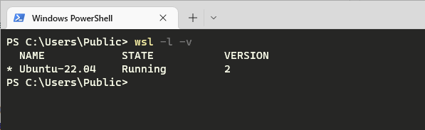
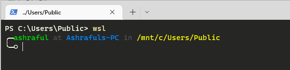
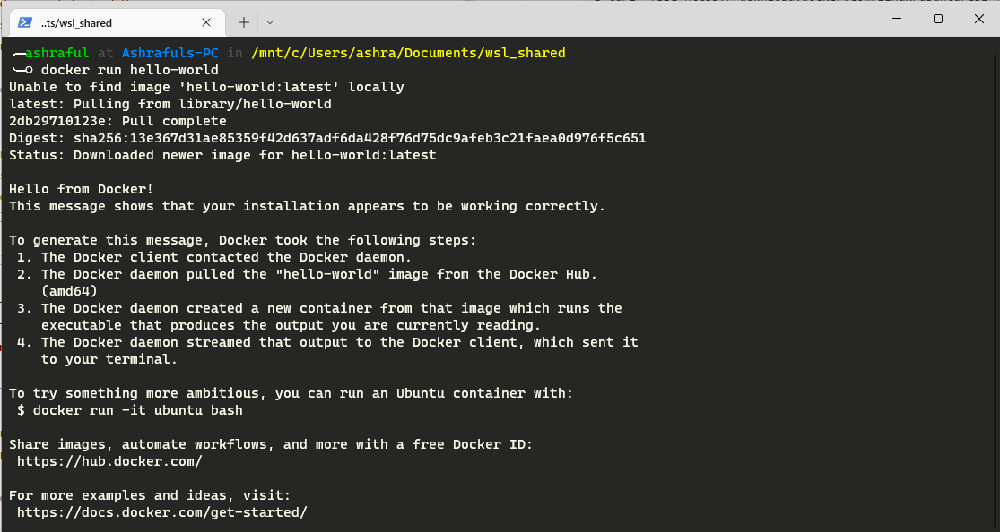
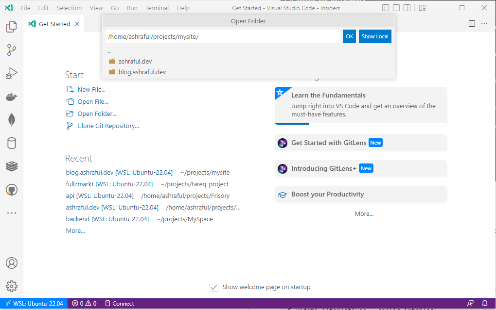

**Today it's not about virtualbox/vmware. It's a new Windows 10 feature. They called it WSL(Windows Subsystem for Linux)**

## What is WSL?
Already told **Windows Subsystem for Linux**. Windows made sure to install Linux operating system inside the Windows environment without extra virtualization software(Virtual Box, VmWare, ...). So, How they did that?? That's burning question. Today I'll not go that way. But one thing I can tell that is, they slightly modified the kernel to fit with windows. Isn't it awesome?? YES! I am really exited to share about it.

## What we are going to cover today?
* Prerequisites
* Enable WSL.
* Install Ubuntu (22.04 Maybe).
* Set WSL Resource.
* Install Docker on Ubuntu.
* VSCode WSL development.
* Intellij IDE WSL development.

## Prerequisites
You must be running Windows 10 version 2004 and higher (Build 19041 and higher) or Windows 11.
> To check your Windows version and build number, select **Windows logo key + R**, type **winver**, select OK.

## Enabling WSL
You can enable from GUI as well as from Powershell. I always prefer the hard way(command line). So, Run the following commands on Powershell.
```
dism.exe /online /enable-feature /featurename:Microsoft-Windows-Subsystem-Linux /all /norestart
```
### Enabling the Virtualization Technology
```
dism.exe /online /enable-feature /featurename:VirtualMachinePlatform /all /norestart
```
**Now you need to restart the machine.**

### Install WSL Update
Downthe the update installer from [here](https://wslstorestorage.blob.core.windows.net/wslblob/wsl_update_x64.msi) and Run the installer.

### Set WSL2 as default WSL version.
```
wsl --set-default-version 2
```
Update existing distribution (if any)
```
wsl --set-version <distribution name> 2
```
## Install Ubuntu (22.04)
There are several ways to install the OS in WSL. You can download from the [Windows Store](https://apps.microsoft.com/store/detail/ubuntu/9PDXGNCFSCZV). This is the hassel free process. Once installed you will be able to login using your given password. **Don't afraid, there is no UI. Only command line like Ubuntu Server :)**

Now open Powershell again,
```
wsl -l -v 
```
You will get something like following,


## Set WSL Resource
Yes. You can still have chance to modify your resource allocation. Otherwise your windows will decide to do so. The process is pretty simple. You need to create a file to a specific location.  
Open the file, 
```
notepad "$env:USERPROFILE\.wslconfig"
```
Add these lines to the editor and save it.
```
[wsl2]
memory=4GB  
processors=4
```
*You can read the [microsoft's document](https://docs.microsoft.com/en-us/windows/wsl/wsl-config) for more configuration*.  
Now login to the ubuntu again, with Powershell/CMD whatever shell you have.
```
wsl
```


## Install Docker on WSL(Ubuntu)
> It's not mandatory. So, don't push yourself into Docker if your are not a Docker guy.

Installing Docker is same guide as ubuntu. You can follow the official [Docker docs](https://docs.docker.com/engine/install/ubuntu/) OR blindly follow me. Run the following commands on the Ubuntu's terminal **not Powershell**.
1. Update the apt package index and install packages to allow apt to use a repository over HTTPS:
```
$ sudo apt update
$ sudo apt install \
   ca-certificates \
   curl \
   gnupg \
   lsb-release
```
2. Add Docker’s official GPG key:
```bash
$ sudo mkdir -p /etc/apt/keyrings
$ curl -fsSL https://download.docker.com/linux/ubuntu/gpg | sudo gpg --dearmor -o /etc/apt/keyrings/docker.gpg
```
3. Use the following command to set up the repository
```bash
$ echo \
  "deb [arch=$(dpkg --print-architecture) signed-by=/etc/apt/keyrings/docker.gpg] https://download.docker.com/linux/ubuntu \
  $(lsb_release -cs) stable" | sudo tee /etc/apt/sources.list.d/docker.list > /dev/null
```
4. Install Docker Engine
```bash
$ sudo apt update
$ sudo apt install docker-ce docker-ce-cli containerd.io docker-compose-plugin
```
5. Start the docker and check
```
$ sudo service docker start
$ sudo service docker status
```
6. Test your docker installation
```
$ sudo docker run hello-world
```
**Output:**


**So, Docker is working.**
### Incase any Network issue from WSL
```
$ echo -e "[network]\ngenerateResolvConf = false" | sudo tee -a /etc/wsl.conf
$ sudo unlink /etc/resolv.conf
$ echo nameserver 1.1.1.1 | sudo tee /etc/resolv.conf
```
### IPTables related issues
I found some people have iptables related errors. So I recommend the following command and **choose legacy**
```bash
$ update-alternatives --config iptables
```

## Setting up VSCode
Actually there is nothing to setup. Trust me and do the following things,
* You just need to install an extension. You can get it [from here](https://marketplace.visualstudio.com/items?itemName=ms-vscode-remote.remote-wsl).
* Create a project on WSL(ubuntu)
* On the bottom left corner you will see remote development button. 
* Select **New WSL Window**
* Open the project from WSL(Ubuntu)


**Now it's all yours.**

## Setting up Intellij IDE (Pycharm in my case.)
* Using Intellij IDE (Pycharm) codes stays on the windows machine.
* Interpreter(Environment) will be just shared from WSL.
The step by step guide is [here](https://www.jetbrains.com/help/pycharm/using-wsl-as-a-remote-interpreter.html#configure-wsl).

## Conclusion
I've talked too much today. But it made me to do so. But, Why I am writing this post?  
**In short**, After 7-8 years I have been trying windows 10. I am so pleased to see the WSL and how it works. So, I thought people may like it too. Thank you.